# TreeGen - Procedural Tree Generator for Unity
# Created by Andrew Degan

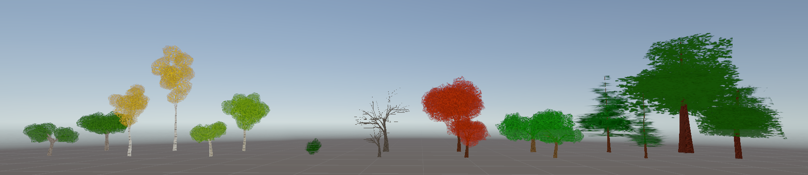

## About

**TreeGen** is a powerful and flexible procedural tree generation tool for Unity that allows you to create realistic and customizable trees directly in your scenes. Whether you need a single tree or an entire forest, TreeGen provides an extensive set of parameters to shape every aspect of your trees—from trunk height and branch density to leaf styles and bark textures.

> **Development Repository**: For more information on the development of this tool, please check out the [Development Repository](https://github.com/adegan1/TreeGen-Development).

### Key Features
- **Fully Procedural**: Generate unique trees with adjustable parameters
- **Multiple Leaf Modes**: Choose between plane leaves, spherical clusters, or dome-style canopies
- **Canopy Targeting**: Guide branch growth toward defined canopy volumes for realistic tree shapes
- **Material Customization**: Full control over bark and leaf materials with UV tiling and randomization
- **Preset System**: Save and load tree configurations for quick iteration
- **Performance Optimized**: Built-in limits and optimization settings for managing complexity
- **Editor-Friendly**: Real-time preview with gizmos and intuitive inspector controls

TreeGen is ideal for game developers, environment artists, and anyone looking to add natural organic elements to their Unity projects without relying on static 3D models.

---

## How To Use

**How to add the package to your Unity project**:
**Step 1**:
Download the package from this Repository onto your system. Please keep track of where this package is located.
**Step 2**:
Open the Unity project that you would like to add the package to.
At the top, click “Window” and go to “Package Management” > “Package Manager”

**Step 3**:
Inside the package manager, click the ‘+’ icon in the top left corner and select “Install package from disk…”

**Step 4**:
Find the package that you downloaded from GitHub and open the folder named “adegan.treegen”
Open the package using “package.json”
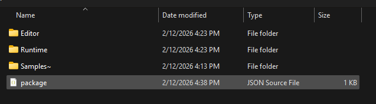
**Step 5**:
Back inside the package manager, you should now see the “TreeGen” package in the “In Project” tab on the left.
Go to the “Samples” tab of the package and press “Import” to add the package assets to your project.

**How to create a tree**:
**Step 1**:
Upon importing the samples, you will find four folders:
‘Images’ includes image files used in the tree materials.
‘Prefabs’ includes a prefab for the Tree Generator game object.
‘Scenes’ includes two example scenes for testing the Tree Generator.
‘TreePresets’ includes the data for the existing tree presets. These can be changed if desired.
To use the Tree Generator in your scene, simply add the Tree Generator prefab from the ‘Prefabs’ folder to your scene.
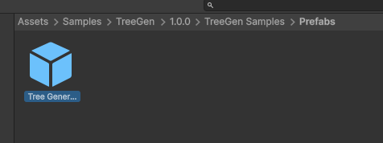

Alternatively, you may simply create an empty game object and add the “TreeGenerator” component to it.
**Step 2**:
If you click on the Tree Generator game object, you can see the generator settings in the inspector.
You may now edit the tree however you like. Simply hit “Regenerate Tree” to create a tree mesh in the editor or in play mode. A tree will also be generated when entering play mode if there is not already a tree attached to the generator.
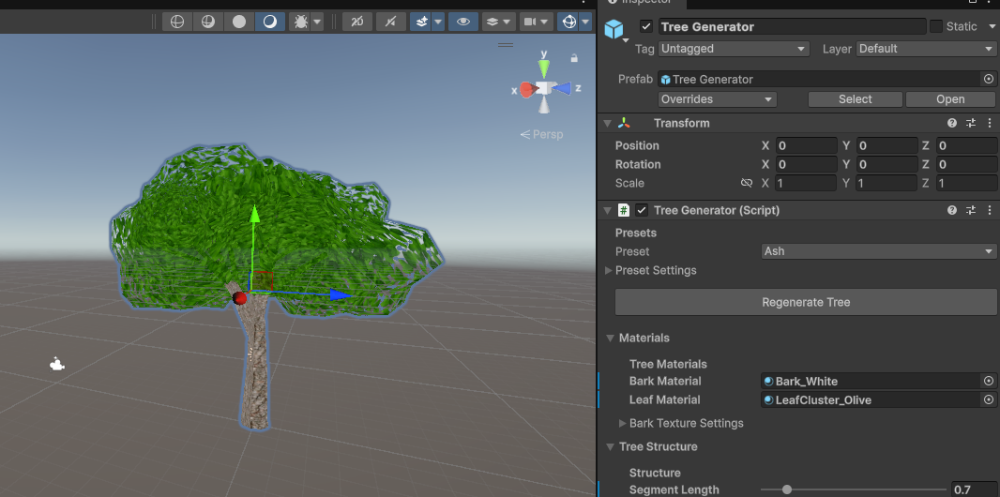
**Step 3**:
When you have created the tree that you like, simply remove the generated tree mesh child object from your Tree Generator and place it wherever you please!

---

## Documentation

### Parameter Reference

#### **Presets**
- **Preset**: Load a saved TreePreset asset to instantly apply a pre-configured tree style

---

#### **Tree Materials**
- **Bark Material**: Material applied to trunk and branches
- **Leaf Material**: Material applied to leaves/foliage
- **Bark Tiling Horizontal** (0.1–10): Controls texture repetition around the branch circumference
- **Bark Tiling Vertical** (0.1–10): Controls texture repetition along the branch length
- **Bark UV Randomness** (0–1): Adds random UV offset per branch to reduce repetition
- **Bark UV Noise Strength** (0–0.5): Organic UV distortion for varied bark appearance
- **Bark UV Noise Scale** (0.1–5): Scale of noise pattern used for UV distortion

---

#### **Structure**
- **Segment Length** (0.1–5): Length of each branch segment in world units
- **Random Seed**: Seed value for deterministic generation (0 = randomized every time)
- **Trunk Height** (1–20): Overall height of the main trunk
- **Trunk Height Variation** (0–0.5): Randomized variation applied to trunk height
- **Trunk Lean Strength** (0–1): How much the trunk curves or leans as it grows
- **Trunk Noise Scale** (0.05–3): Noise scale affecting trunk direction changes
- **Trunk Noise Strength** (0–0.8): Intensity of direction variation along the trunk

---

#### **Branches**
- **Branch Levels** (0–5): Number of branching iterations (0 = no branches, higher = more complexity)
- **Branches Per Level** (1–12): How many child branches spawn from each parent branch
- **Branch Level Density Falloff** (0.2–1): Reduces branch counts at higher levels for natural tapering
- **Branch Length Factor** (0.2–1.2): Primary branch length as a fraction of trunk height
- **Branch Length Falloff** (0.3–0.9): How much shorter each branching level becomes
- **Branch Angle Min** (0–90°): Minimum angle branches diverge from parent direction
- **Branch Angle Max** (0–90°): Maximum angle branches diverge from parent direction
- **Branch Upward Bias** (0–1): Biases branch growth upward for more realistic trees
- **Branch Droop** (0–1): Makes branch tips droop downward
- **Branch Noise Scale** (0.05–3): Noise scale for branch direction variation
- **Branch Noise Strength** (0–0.8): Intensity of noise-based direction changes
- **Branch Twist Jitter** (0–60°): Random azimuth offset for branch distribution around parent
- **Max Generated Branches** (0–500): Hard limit on total branch count (0 = unlimited)
- **Min Branch Upward** (-0.2–0.5): Prevents branches from growing too far downward
- **Clamp Branches Above Base**: Keeps all branch points above the generator's base height
- **Branch Ground Clearance** (0–2): Minimum clearance above base when clamping is enabled

---

#### **Canopy Targeting**
- **Canopy Target Enabled**: Enables branch attraction toward a defined canopy volume
- **Canopy Center Offset**: Center position of the canopy ellipsoid relative to the generator
- **Canopy Radii**: X, Y, Z radii defining the canopy ellipsoid shape
- **Canopy Attraction** (0–1): Strength of branch bias toward the canopy volume
- **Canopy Surface Target**: Targets the canopy surface instead of its center
- **Canopy Height Start** (0–1): Normalized height where canopy attraction begins (0 = base, 1 = top)
- **Canopy Height End** (0–1): Normalized height where canopy attraction ends

---

#### **Thickness**
- **Base Thickness** (0.1–2): Starting radius of the trunk at the base
- **Branch Thinning Rate** (0.5–1): How quickly branches thin along their length (1 = no thinning)
- **Child Branch Thickness** (0.3–0.95): Thickness multiplier for child branches relative to parent

---

#### **Leaves**
- **Leaf Mode**: Choose generation style:
  - **Planes**: Traditional quad-based flat leaves
  - **Clusters**: Spherical clusters of foliage around branch tips
  - **Domes**: Open-bottom dome shapes for soft canopies
- **Leaf Width** (0.05–10): Width of plane leaves (Planes mode only)
- **Leaf Length** (0.05–10): Length of plane leaves (Planes mode only)
- **Leaf Density** (0–20): Number of leaves per branch segment (Planes) or cluster density (Clusters/Domes)
- **Leaf Start Height** (0–1): Normalized height where leaves begin appearing (0 = base, 1 = top)
- **Leaf Size Variation** (0–1): Random size variation for leaves/clusters
- **Double Sided Leaves**: Makes plane leaves visible from both sides (Planes mode only)
- **Leaf Distance From Branch** (-0.5–1): Offset distance from branch surface (Planes mode only)

---

#### **Plane Leaf UVs**
- **Plane Leaf Texture Tiling** (0.1–10): UV tiling for plane leaf textures

---

#### **Plane Leaf Size By Height**
- **Enable Plane Leaf Size By Height**: Scales plane leaf size from bottom to top
- **Plane Leaf Size Bottom** (0.1–10): Size multiplier at tree base
- **Plane Leaf Size Top** (0.1–10): Size multiplier at tree top

---

#### **Leaf Appearance**
- **Leaf Transparency** (0–1): Overall foliage opacity (material must support transparency)
- **Leaf UV Randomness** (0–1): Random UV offset per leaf to break up repetition
- **Leaf UV Noise Strength** (0–0.5): Noise-based UV distortion for organic variation
- **Leaf UV Noise Scale** (0.1–5): Scale of noise pattern for UV distortion

---

#### **Leaf Clusters (Cluster Mode)**
- **Cluster Radius** (0.2–10): Base size of each spherical cluster
- **Cluster Size Min** (0.5–1): Minimum cluster size multiplier for randomization
- **Cluster Size Max** (1–2): Maximum cluster size multiplier for randomization
- **Cluster Shape X/Y/Z** (0.5–2): Ellipsoid stretching along each axis (1 = sphere)
- **Cluster Noise Strength** (0–0.5): Surface irregularity/bumpiness
- **Cluster Noise Scale** (0.5–5): Noise pattern scale for irregularity
- **Enable Outer Shell**: Adds a transparent outer layer for depth
- **Outer Shell Thickness** (1.05–1.5): Shell size as a multiplier of cluster radius
- **Outer Shell Transparency** (0–1): Opacity of the outer shell layer
- **Cluster Segments** (4–32): Mesh resolution (higher = smoother but more expensive)
- **Cluster Texture Tiling** (0.5–10): UV tiling on cluster spheres
- **Randomize Cluster Rotation**: Adds random rotation to each cluster for variation
- **Cluster Offset** (-1–2): Distance clusters extend from branch tips

---

#### **Leaf Domes (Dome Mode)**
- **Dome Radius** (0.2–10): Base radius of each dome
- **Dome Shape X/Y/Z** (0.5–2): Ellipsoid stretching along each axis (1 = sphere)
- **Dome Offset** (-1–2): Distance domes extend from branch tips
- **Dome Segments** (4–32): Mesh resolution around the dome
- **Dome Noise Scale** (0.5–5): Noise pattern scale for irregularity
- **Dome Noise Strength** (0–0.5): Surface irregularity/bumpiness
- **Randomize Dome Rotation**: Adds random rotation to each dome for variation
- **Dome Texture Tiling** (0.5–10): UV tiling on dome surfaces

---

#### **Leaf Performance**
- **Max Leaf Count** (0–10000): Hard limit on total leaf elements generated (0 = unlimited)
- **Optimize Leaf Distribution**: Reduces foliage on thinner branches
- **Min Branch Radius For Leaves** (0–0.5): Minimum branch thickness required to spawn leaves

---

#### **Branch Connection**
- **Branch Blend Distance** (0–1): How far child branches extend into parent branches for smoother connections

---

## Example Outputs

Below is a handful of tree examples generated from the presets included in the package.
Each preset can be edited or ignored entirely for more customized trees.

### Ash Tree + Young Variant
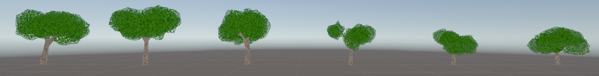

### Aspen Tree + Young Variant
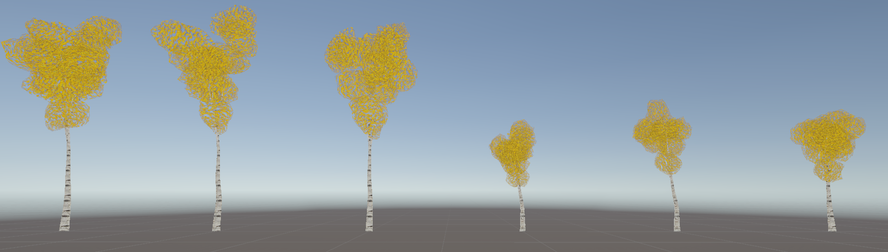

### Birch Tree + Young Variant
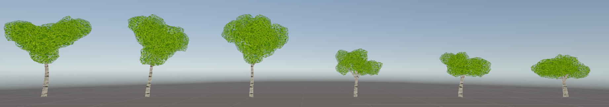

### Bush
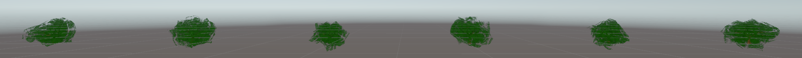

### Leafless Tree + Young Variant
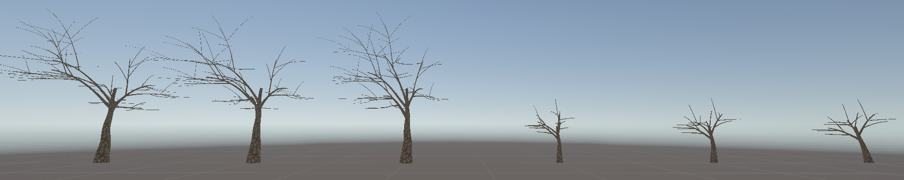

### Maple Tree + Young Variant
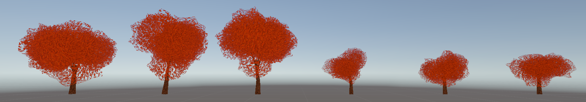

### Oak Tree + Young Variant
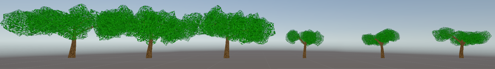

### Pine Tree + Young Variant

### Redwood Tree + Young Variant

---

## Known Limitations

### Performance Considerations
- **High Branch/Leaf Counts**: Trees with many branching levels and high leaf density can generate thousands of vertices. Use the `Max Generated Branches` and `Max Leaf Count` parameters to maintain performance in real-time applications.
- **Real-Time Generation**: Tree generation is intended for editor-time or occasional runtime use. Generating complex trees every frame is not recommended.

### Mesh Complexity
- **Single Mesh**: Each tree is generated as a single combined mesh. Very complex trees may approach Unity's vertex limit for a single mesh (65,535 vertices for 16-bit index buffers).
- **No LOD System**: TreeGen does not currently include built-in Level of Detail (LOD) generation. For distant trees, consider using simpler parameter settings or creating LOD meshes manually.

### Material Requirements
- **Transparency Support**: Leaf transparency and outer shell features require materials with transparency support (e.g., URP/Lit shader with Alpha Clipping or Transparent surface type).
- **UV Layout**: Generated UVs are procedural and may not perfectly align with all texture types. Best results are achieved with tileable textures.

### Canopy Targeting
- **Approximation**: Canopy targeting biases branch direction but does not guarantee branches will perfectly fill the volume. Extreme canopy shapes or attraction values may produce unnatural results.
- **Performance Impact**: Canopy calculations add minor computational overhead during generation.

### Branch Distribution
- **Overlap**: Branches may occasionally intersect or overlap, especially with high branch counts or extreme angle settings.
- **Ground Penetration**: Without "Clamp Branches Above Base" enabled, low branches may extend below the generator's base position.

### Preset System
- **Version Compatibility**: TreePreset assets created in older versions of TreeGen may not include newly added parameters and will use default values for those settings.

### Editor Workflow
- **Undo/Redo**: Generated tree meshes are not automatically registered with Unity's undo system. Use the "Regenerate Tree" button after parameter changes.
- **Play Mode Changes**: Parameter changes made during Play mode are not saved. Edit parameters in Edit mode or apply changes to a prefab.

---

## Tips for Best Results

1. **Start Simple**: Begin with low branch levels and leaf density, then increase complexity as needed
2. **Use Presets**: Save successful tree configurations as presets for reuse across projects
3. **Texture Tiling**: Adjust UV tiling parameters to match your material textures for best visual quality
4. **Random Seeds**: Use specific seed values for reproducible results, or set to 0 for variation
5. **Canopy Shaping**: Enable canopy targeting and adjust the gizmo in the scene view for precise tree silhouettes
6. **Performance Testing**: Monitor frame rates when generating complex trees at runtime and adjust limits accordingly

---

**Package Version**: 1.0.0  
**Unity Version**: 6000.2+  
**Dependencies**: Universal Render Pipeline (URP) 17.2.0

For questions, issues, or feature requests, please contact the package author.